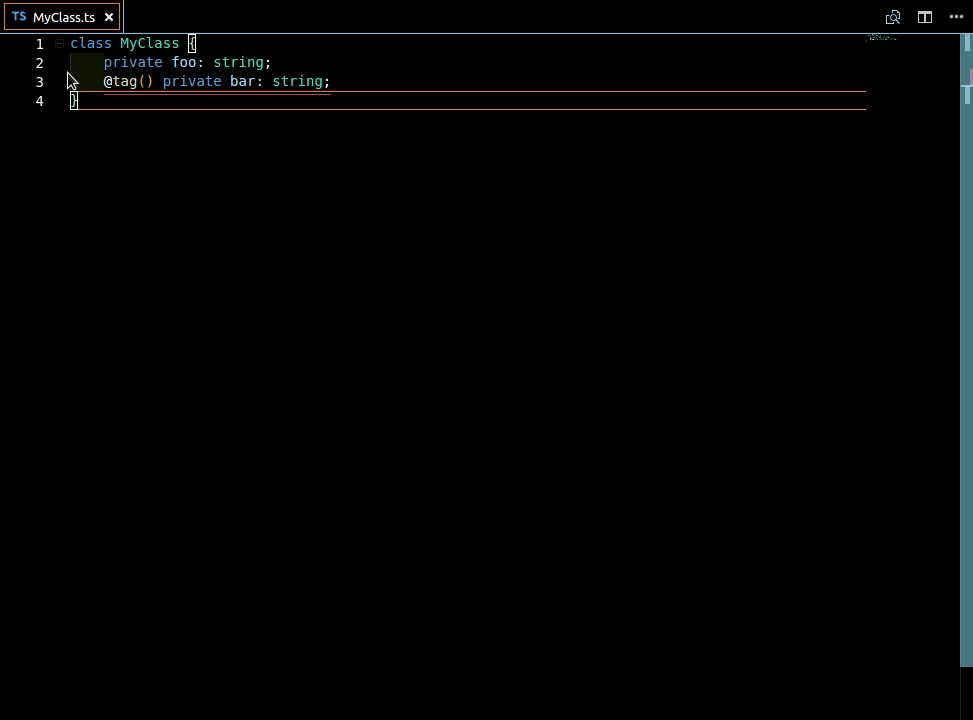

# Getter & Setter Generator 

Transforms typescript attributes into getter & setter, renaming original attribute's name.

## Features
- Transforms attributes into getters
- Transforms attributes into setters
- Renames attributes identifier

#### Transform getters (`alt+s`)

#### Transform setters (`alt+d`)

#### Transform setters & getters (`alt+f`)

#### Rename attributes name (`alt+a`)

## Requirements
- Typescript 2.8.3
- Visual Studio code 1.23.1

## Extension Settings
This extension contributes the following settings:

* `tsattribute-tools.comments`: enable/disable comments generation

## Known Issues

* Please report any issue to help me improve this extension

## Release Notes

Current available version logs.

### 1.0.0

Initial release of tsattributes-tools:

- Getter generation support
- Setter generation support
- Attributes renaming support

-----------------------------------------------------------------------------------------------------
**Enjoy!**
